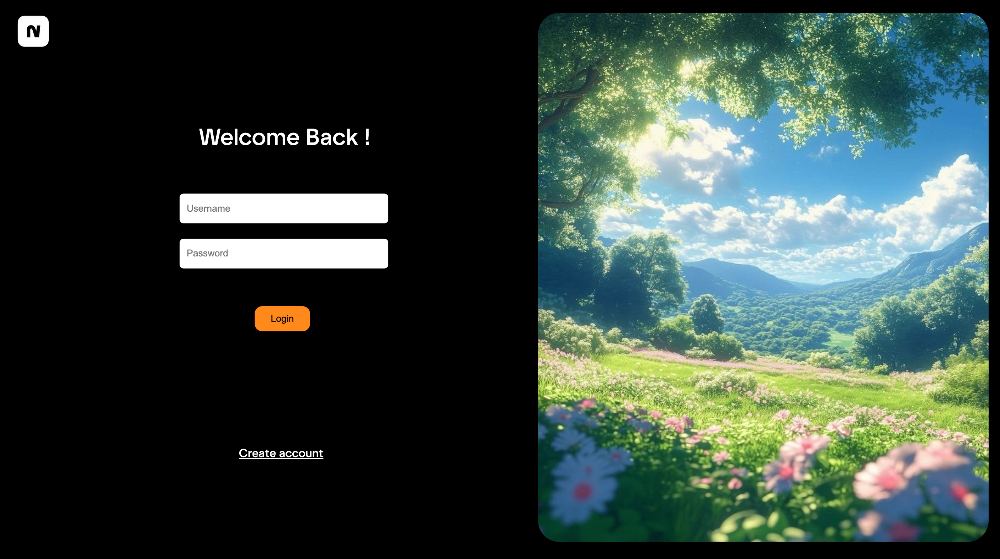

<p align="center"> 
</p>

<h1 align="center">Noter</h1>

<p align="center"> Your free, open source and simple note taking app
</p>

---


<p align="center">
  
  
  
  


  
  
</p>

> [!IMPORTANT]
> **AI Usage:** I used Chatgpt to write me app.py routings. This contains URL routing and backend data. This is easy and I do understand the functions chatgpt wrote. The frontend is written by me but i used chatgpt with html (not css) sometimes which i wanted to do a very less amount of changes and wanted to conserve some html structure. 

> [!NOTE]
> This site is pritty fast as the entire frontend is written using light customcss by myself. This was my first time making a flask app and it was soo fun. Its not that hard like django only some functions and url routing work well.

## Things I learned from this project
- How to write backend in python using flask
- How to use flask-login
- How to use dynamic SQL building
- How to make web apps faster using this backend
- URL routing
- Templating
- Jinja

## Screenshot


## Pages

### Login

The first page a user sees with a beautiful landscape

### Create account page

UI same as login but users are supposed to register here

### index.html

main page that index all of your blogs.

### view.html

to see the blogs
 ### Password_change.html

 to change the password of caccount

## Tech Stack
- Flask
- Flask Login
- HTML
- CSS
- Ubantu

I made this using only custom css. No tailwind/frameworks and components

## Running Locally

1) Clone the repository:

```sh
git clone https://github.com/aryanbrite/flask.git 
```

2)
 ```sh
 cd flask
```

3) 
```sh
 cd flask
```

4) MACOS
```sh
python3 -m venv .venv
source .venv/bin/activate
```

or

Windows

```sh
python -m venv .venv
.venv\Scripts\activate
```
4) MACOS
```sh
pip install -r requirements.txt
```

## Run the App
```sh
python app.py
```

open http://127.0.0.1:5000

---

Made with love, bad decisions, and way too much free time.

© [The MIT LIcense](LICENSE) - Aryan Brite
